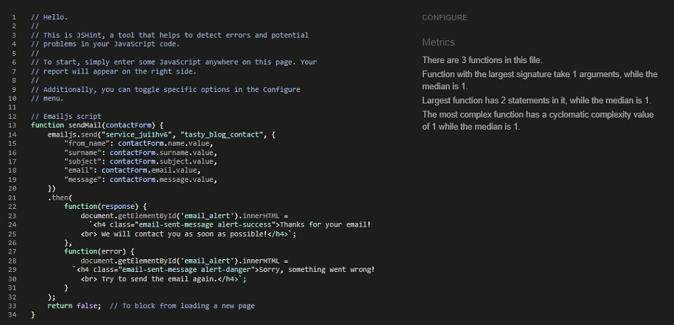
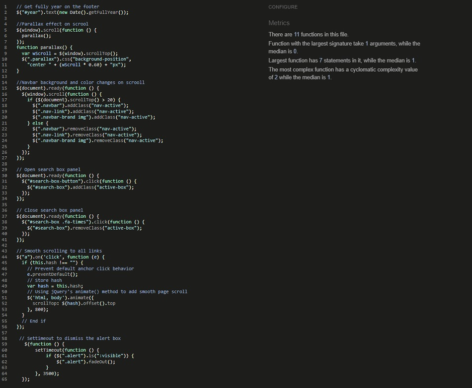
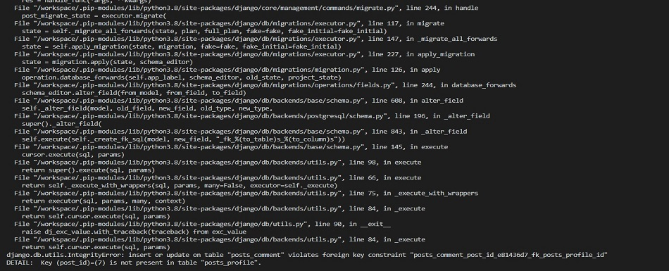

# Testing
Back to the [README](README.md)

* Testing has taken place continuously throughout the development of the project. Each view was tested regularly. 
  When the outcome was not as expected, debugging took place at that point.  

### Python Validation - PEP8
* Python testing was done using the PEP8 Online to ensure there were no syntax errors in the project. All python files
were entered into the online checker and no errors were found in any of the custom codes.

#### Tasty Blog - Posts
* [admin.py](./assets/readme/test/pep8/posts_pep8_admin.jpg)
* [apps.py](./assets/readme/test/pep8/posts_pep8_apps.jpg)
* [models.py](./assets/readme/test/pep8/posts_pep8_models.jpg)
* [apps.py](./assets/readme/test/pep8/posts_pep8_apps.jpg)
* [forms.py](./assets/readme/test/pep8/posts_pep8_forms.jpg)
* [signals.py](./assets/readme/test/pep8/posts_pep8_signals.jpg)
* [urls.py](./assets/readme/test/pep8/posts_pep8_urls.jpg)
* [views.py](./assets/readme/test/pep8/posts_pep8_views.jpg)
* [context_processors.py](./assets/readme/test/pep8/posts_pep8_context_processor.jpg)

#### Tasty Blog - Books
* [admin.py](./assets/readme/test/pep8/books_pep8_admin.jpg)
* [forms.py](./assets/readme/test/pep8/books_pep8_forms.jpg)
* [models.py](./assets/readme/test/pep8/books_pep8_models.jpg)
* [urls.py](./assets/readme/test/pep8/books_pep8_urls.jpg)
* [views.py](./assets/readme/test/pep8/books_pep8_views.jpg)

#### Tasty Blog - Tastyblog
* [asgi.py](./assets/readme/test/pep8/tastyblog_pep8_asgi.jpg)
* [urls.py](./assets/readme/test/pep8/tastyblog_pep8_urls.jpg)
* [wsgi.py](./assets/readme/test/pep8/tastyblog_pep8_wsgi.jpg)
* [settings.py](./assets/readme/test/pep8/tastyblog_pep8_settings.jpg)
* A few errors were raised in the tastyblog/settings.py file, however these were related to default django authorisation
code and could not be changed to remove the errors.
* [manage.py](./assets/readme/test/pep8/pep8_manage.jpg)

### Lighthouse
Lighthouse was used to test Performance, Best Practices, Accessibility and SEO on Desktop.

##### Desktop Results:

### HTML Validation

### CSS Validation

* Custom CSS was validated using W3C Jigsaw validation service. Forty-three warnings were displayed, however, 
  these are related to Google Fonts and vendor extension prefixes which will not affect the CSS performance.

### JavaScript Validation

### jQuery Validation

## Manual Testing
### Frontend
* The Signup, Login and Logout system has no issues and is working accordingly. It shows the right 
  interactive message to the users.
* The Profile Page is working properly. It updates the user information and uploads/updates the 
  user profile image. It shows the interactive message to the user once the update is complete.
* The user profile image in the navbar and Post Details page has no issues and shows the user image 
  when it is uploaded by the user on the Profile Page.
* All the internal links are working and bring the user to the right page on the website.
* All the external links are working and bring the user to the right social media page by 
  opening a new browser tab.
* The Categories Page shows the recipes filtered by category without issues.
* The drop-down menu in the navbar shows a list of categories on every page of the website.
* The contact form on the Contact Page is working without any errors.  It sends an email, 
  to the info@tastyblog, once the user fills in the form and clicks on the send button. 
  Both interactive messages for email success or failure are also displayed on the screen.
* The pagination system is working. It adds another page after 6 posts on the page.
* On the Post Details Page, the Like/unlike functionality is working without issues and shows 
  the right interactive message to the user when the heart icon is clicked.
* The comment form has no issues and it submits a new comment once the form is completed by a
  registered user. 
  The comment is displayed once the submit button is pressed. The two interactive messages for 
  this action are working without errors. 
* The functionality to delete a message, previously sent by the user or by the superuser, is 
  working without issues. The Bootstrap model is open to asking the user if they want to delete 
  the message. Once the action is complete, the interactive message is displayed at the top of the page.
* The functionality to update a message, previously sent by the user or by the superuser, is 
  working without issues. A new page is open, to update the comment when the button edit is 
  pressed. Once the action is complete, the interactive message is displayed at the top of the page. 
* On the Books Page, the CRUD functionality is working without issues. Logged in users can create a new 
  post such as update or delete their own posts, also any post can be updated or deleted on this page by the Superuser.  

### Backend/Admin Panel
* I have tested the Admin Panel repeatedly since the start of the project development. All the models are working without issues.  
  I have created, deleted, and updated data in all models without errors. The models have the behavior expected for what they were built for.
* Whenever a user comments on a post or submits a book post the Superuser has to approve it before it will be displayed on the website. This functionality is 
  working without issues.
* When the author is posting a new recipe all the required fields have to be filled otherwise the author can't submit the post to the database.

### Manual Test Case
The Test case for this project can be found [here](./assets/readme/test/test_case/)

## Bugs

### Terminal Bug

#### Comment Model 

#### Terminal Error

* While I was developing the project I tried to add a comment profile Image to the comments model by adding a 
  foreign key related to the profile model. When I was doing the migrations, the terminal required a default 
  number for the new foreign key.  I added the number zero however this was not the correct default option. 
  When I ran the migrations I got an error message on the terminal, saying that "(post_id)=(7) is not present in the table".

### Fixed Bug

* I spent a considerable amount of time trying to rectify this error. I sought advice from my slack community colleagues and researched 
  an online solution. I was advised to reset my database on Heroku and then run migrate on the terminal. 
  I followed the advice and I fixed the issue by resetting my project database.
